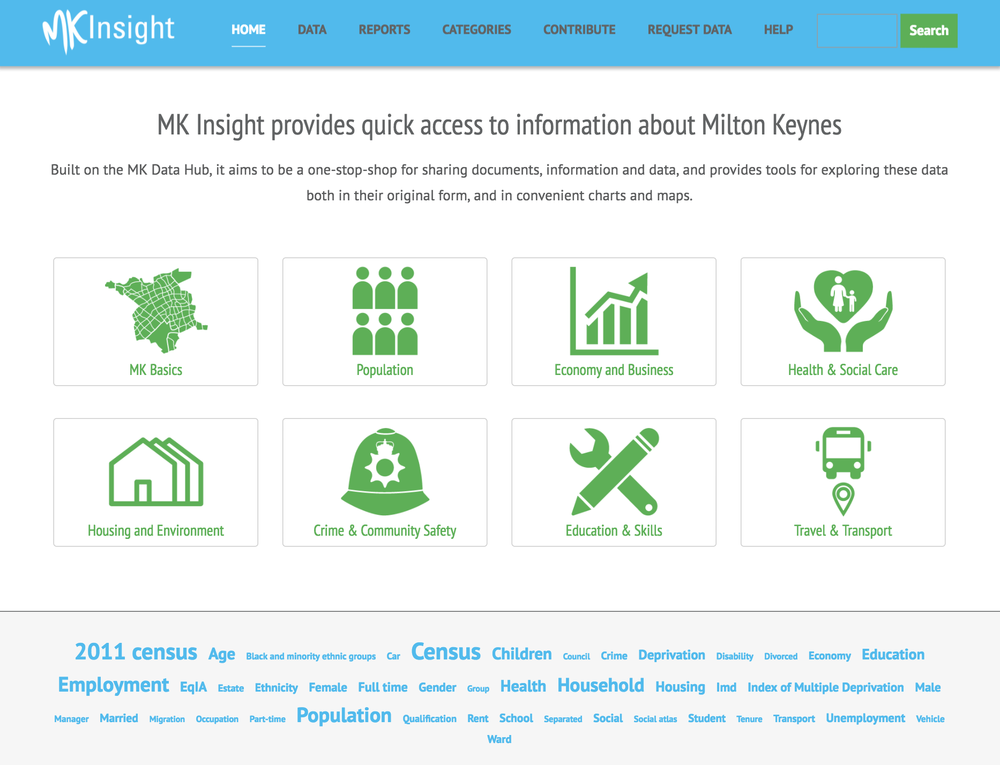

# mkinsight-theme

**mkinsight-theme** is a [WordPress](https://wordpress.org) theme developed for [MK:Insight](http://mkinsight.org) project




## How to use it

As any other themes for WordPress, mkinsiht-theme can be used by uploading it 
into ``wp-contents/themes`` directory, enabling it from WordPress admin backend.

For further information please refer to [WordPress guide about themes](https://codex.wordpress.org/Using_Themes)


### WordPress dependencies

Currently MK:Insight is running under WordPress version 4.7.8

Following the list of required plugins:

- [amr shortcode any widget](http://mkinsight.org/wp-admin/plugin-install.php?tab=plugin-information&plugin=amr-shortcode-any-widget&TB_iframe=true&width=600&height=550)
- [Bop Search Box Item Type For Nav Menus](http://mkinsight.org/wp-admin/plugin-install.php?tab=plugin-information&plugin=bop-search-box-item-type-for-nav-menus&TB_iframe=true&width=600&height=550)
- [Contact Form DB](http://wordpress.org/extend/plugins/contact-form-7-to-database-extension/)
- [Cookie Consent](http://mkinsight.org/wp-admin/plugin-install.php?tab=plugin-information&plugin=uk-cookie-consent&TB_iframe=true&width=600&height=550)
- [Disable Comments](http://mkinsight.org/wp-admin/plugin-install.php?tab=plugin-information&plugin=disable-comments&TB_iframe=true&width=600&height=550)
- [Disable Real MIME Check](http://mkinsight.org/wp-admin/plugin-install.php?tab=plugin-information&plugin=disable-real-mime-check&TB_iframe=true&width=600&height=550)
- [Idea Factory](http://mkinsight.org/wp-admin/plugin-install.php?tab=plugin-information&plugin=idea-factory&TB_iframe=true&width=600&height=550)
- [iframe](http://mkinsight.org/wp-admin/plugin-install.php?tab=plugin-information&plugin=iframe&TB_iframe=true&width=600&height=550)
- [List category posts](http://mkinsight.org/wp-admin/plugin-install.php?tab=plugin-information&plugin=list-category-posts&TB_iframe=true&width=600&height=550)
- [Ultimate Social Media PLUS](http://mkinsight.org/wp-admin/plugin-install.php?tab=plugin-information&plugin=ultimate-social-media-plus&TB_iframe=true&width=600&height=550)
- [Very Simple Contact Form](http://mkinsight.org/wp-admin/plugin-install.php?tab=plugin-information&plugin=very-simple-contact-form&TB_iframe=true&width=600&height=550)
- [WP Attachments](http://mkinsight.org/wp-admin/plugin-install.php?tab=plugin-information&plugin=wp-attachments&TB_iframe=true&width=600&height=550)
- [WP Statistics](http://mkinsight.org/wp-admin/plugin-install.php?tab=plugin-information&plugin=wp-statistics&TB_iframe=true&width=600&height=550)

## Development

1. Download [WordPress downloads](https://wordpress.org/downloads)
2. Copy / Clone ``mkinstight-theme within`` within ``./wp-content/themes`` folder

For further information about the general mechanics of themes in WordPress, please refer to the official [theme handbook](https://developer.wordpress.org/themes/getting-started/)

## Dependencies

- [mkio2](https://github.com/mdaquin/mkio2) data visualisation and data exploration library for [MK:Datahub](https://datahub.mksmart.org)
- [Bootstrap](https://getbootstrap.com)
- [JQuery mobile](https://jquerymobile.com)
- [JQuery easing](http://gsgd.co.uk/sandbox/jquery/easing/)
- [modernizr](https://modernizr.com)
- [inline tweet](https://ireade.github.io/inlinetweetjs/)

## Theme Structure
```
|-- mkinsight-theme
    |-- 404.php
    |-- archive.php
    |-- attachment.php
    |-- author.php
    |-- category-default.php
    |-- category.php
    |-- chart-generator-template.php
    |-- comments.php
    |-- entry-content.php
    |-- entry-footer.php
    |-- entry-meta.php
    |-- entry-summary.php
    |-- entry.php
    |-- footer.php
    |-- functions.php
    |-- header.php
    |-- index.php
    |-- nav-below-single.php
    |-- nav-below.php
    |-- page.php
    |-- readme.txt
    |-- resources-page-template.php
    |-- screenshot.png
    |-- search.php
    |-- sidebar.php
    |-- single.php
    |-- style.css
    |-- tag.php
    |-- assets
    |   |-- css
    |   |   |-- bootstrap.css
    |   |   |-- hoverex-all.css
    |   |   |-- ionicons.min.css
    |   |   |-- style.css
    |   |-- fonts
    |   |-- img
    |   |-- includes
    |   |   |-- get-tweets.php
    |   |   |-- shortcode-wpautop-control.php
    |   |   |-- twitter.php
    |   |   |-- twitteroauth
    |   |       |-- OAuth.php
    |   |       |-- twitteroauth.php
    |   |-- js
    |       |-- bootstrap.min.js
    |       |-- ie10-viewport-bug-workaround.js
    |       |-- inline-tweet.min.js
    |       |-- jquery.easing.min.js
    |       |-- jquery.mobile.custom.min.js
    |       |-- modernizr-2.8.3.min.js
    |-- mkio2
```